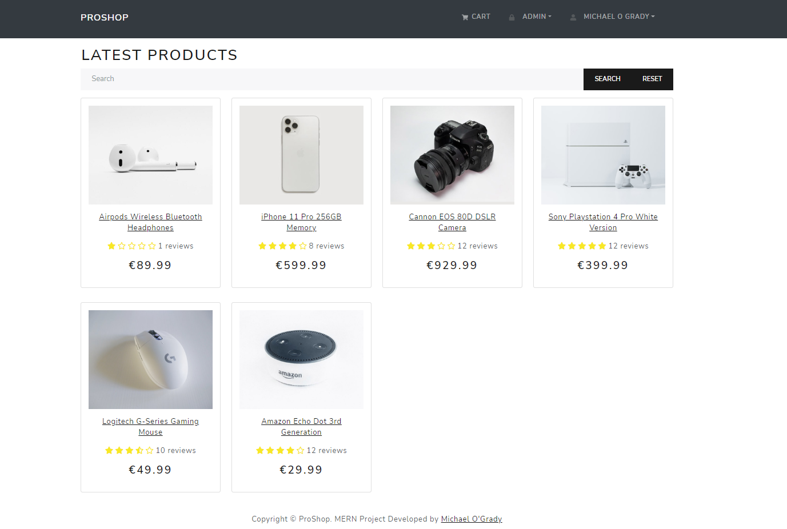
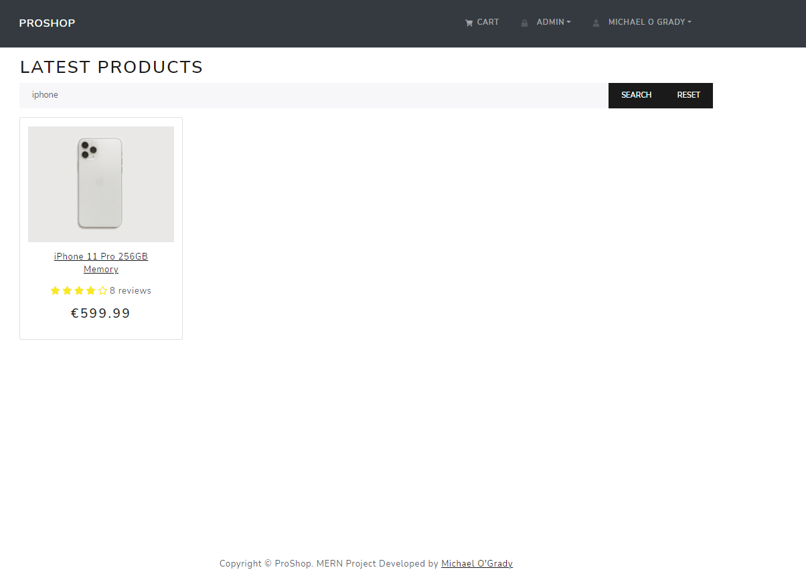
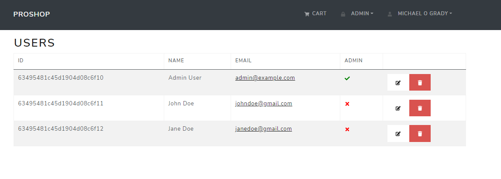
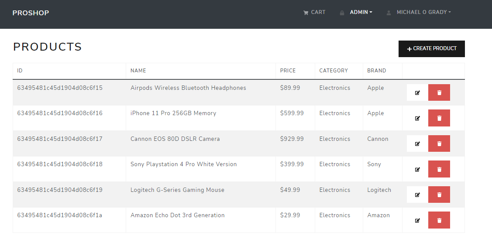
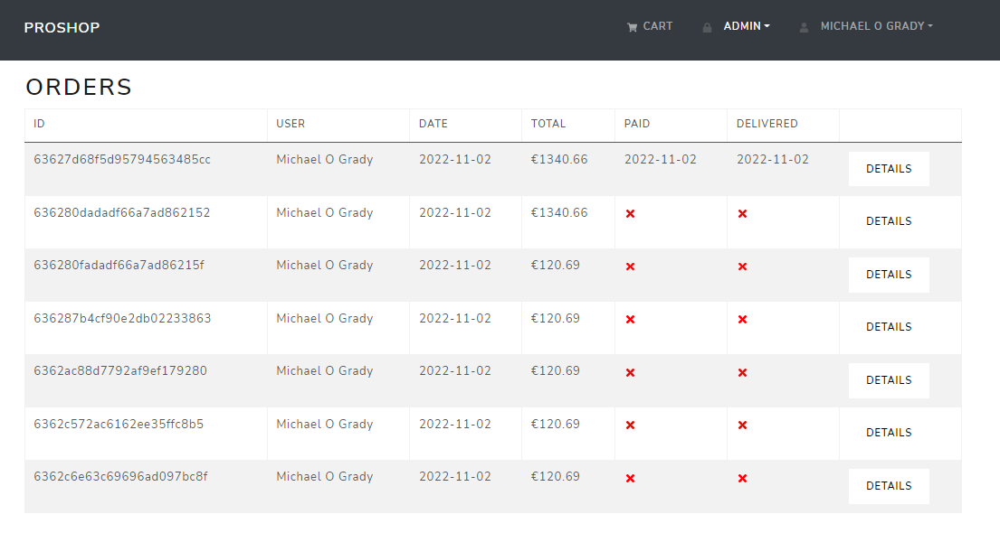
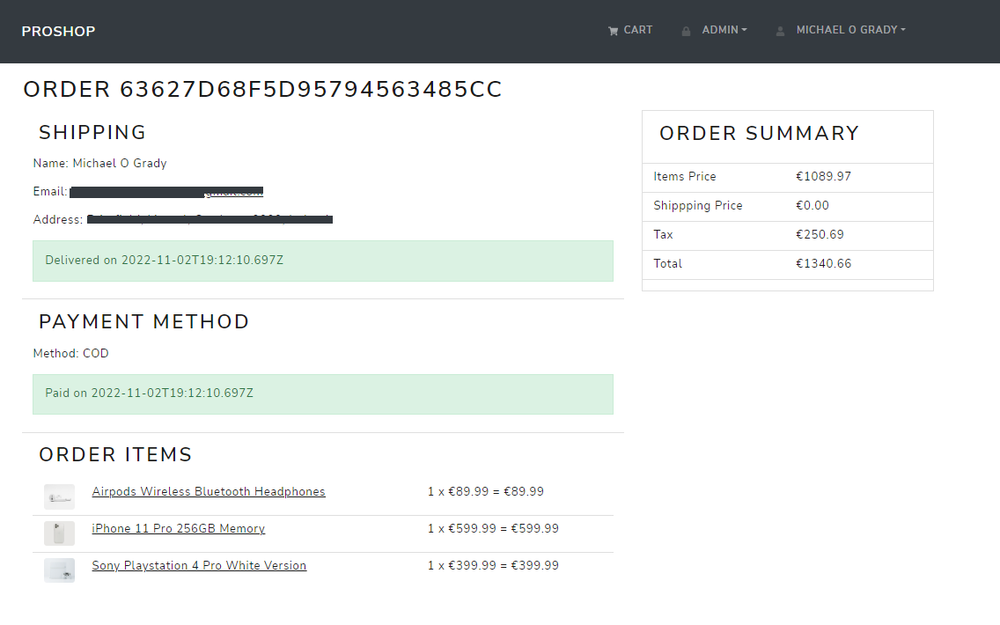
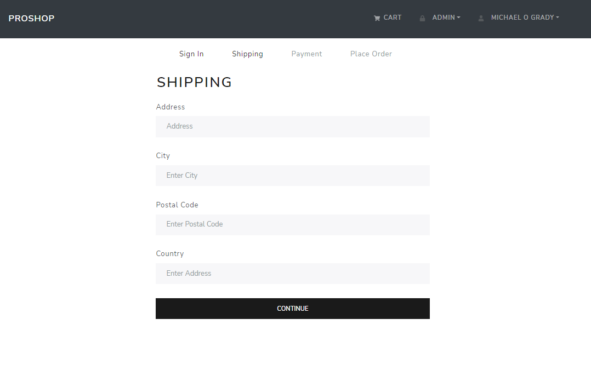
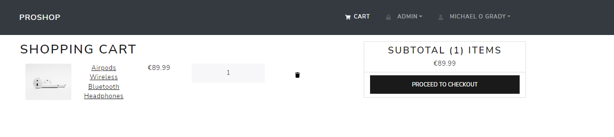
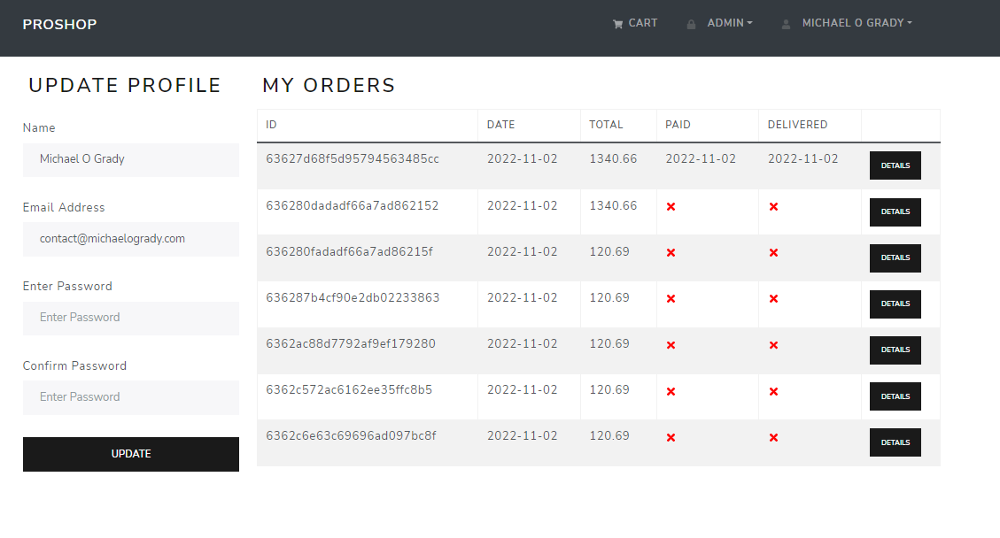

# ProShop-MERN-Ecommerce

> Full stack MERN ecommerce website with PayPal and Stripe payment integration

- Stopped at point before adding PayPal Payment processing

<p align="center">
 
 
 
 
 
 
 
 
 
</p>

# Table of Contents

- [ProShop-MERN-Ecommerce](#proshop-mern-ecommerce)
- [Table of Contents](#table-of-contents)
  - [Packages](#packages)
  - [Frontend](#frontend)
  - [Backend](#backend)
- [Instructions](#instructions)
- [Converting commonjs to esm](#converting-commonjs-to-esm)
  - [Seeder](#seeder)
  - [Middleware](#middleware)
  - [Redux Toolkit](#redux-toolkit)
- [Admin](#admin)
- [Instructions](#instructions-1)

---

- [React Bootstrap](https://react-bootstrap.github.io/)
- [Bootswatch](https://bootswatch.com/)
- [font-awesome - v6.2](https://fontawesome.com/)
- [@reduxjs/toolkit](https://redux-toolkit.js.org/)
- [react-redux](https://react-redux.js.org/)
- [Express] (https://expressjs.com/)
- [Concurrently] (https://www.npmjs.com/package/concurrently)
- [Nodemon] (https://www.npmjs.com/package/nodemon)
- [dotenv] (https://www.npmjs.com/package/dotenv)
- [Mongoose] (https://mongoosejs.com/)
- [colors] (https://www.npmjs.com/package/colors)
- [bcryptjs] (https://www.npmjs.com/package/bcryptjs)
- [express-async-handler] (https://www.npmjs.com/package/express-async-handler)

## Packages

## Frontend

- `npm i react-bootstrap bootstrap`
- `npm i react-router-dom`
- `npm i react-router-bootstrap`
- `npm install @reduxjs/toolkit react-redux` (Redux Toolkit)
- `npm i react-icons` (font-awesome)

## Backend

- `npm i express` backend server
- `npm i axios` http libary for making http requests to backend, it's easier and more powerful(could also use fetch)
- `npm i -D nodemon concurrently` run both backend and frontend at the same time - install as dev dependency
- `npm i dotenv` to use environment variables
- `npm i mongoose` object modeling for mongodb
- `npm i colors` to colorize console output
- `npm i bcryptjs` for password hashing
- `npm i express-async-handler` to handle async errors in express routes
- `npm i jsonwebtoken` for authentication

# Instructions

- `npm run client` to run frontend
- `npm run server` to run backend
- `npm run dev` to run both frontend and backend using concurrently
-

# Converting commonjs to esm

```js
// package.json
{
  "type": "module"
}
```

- [Node.js v18.10.0 documentation](https://nodejs.org/api/packages.html#type)

## Seeder

Script to load database with Mongoose

## Middleware

Server side code that runs before the route handler

## Redux Toolkit

Upgraded to Redux Tookit. Data is fetched through redux action and is passed down to the components through state.

- Flow of how Redux works
  - Creating a Constant
  - Creating a Reducer
  - Creating an Action

> Redux Toolkit is a package that contains a set of tools to help you write Redux logic more easily. It is intended to be the standard way to write Redux logic.

- [Redux Toolkit](https://redux-toolkit.js.org/)
- [Quick Start](https://redux-toolkit.js.org/tutorials/quick-start)
-

# Admin

- username: `admin@example.com`
- password: `123456`

# Instructions

- Create a .env file in the root directory and add the following
  - NODE_ENV = development
  - PORT = 5000
  - MONGO_URI = your mongodb uri
  - JWT_SECRET = 'somethingsecret'
  - PAYPAL_CLIENT_ID = your paypal client id
- run `npm i` to install dependencies
- run `npm run data:import` to import data to mongodb
- run `npm run dev` to run the app in development mode
- run `npm run data:destroy` to destroy data in mongodb
